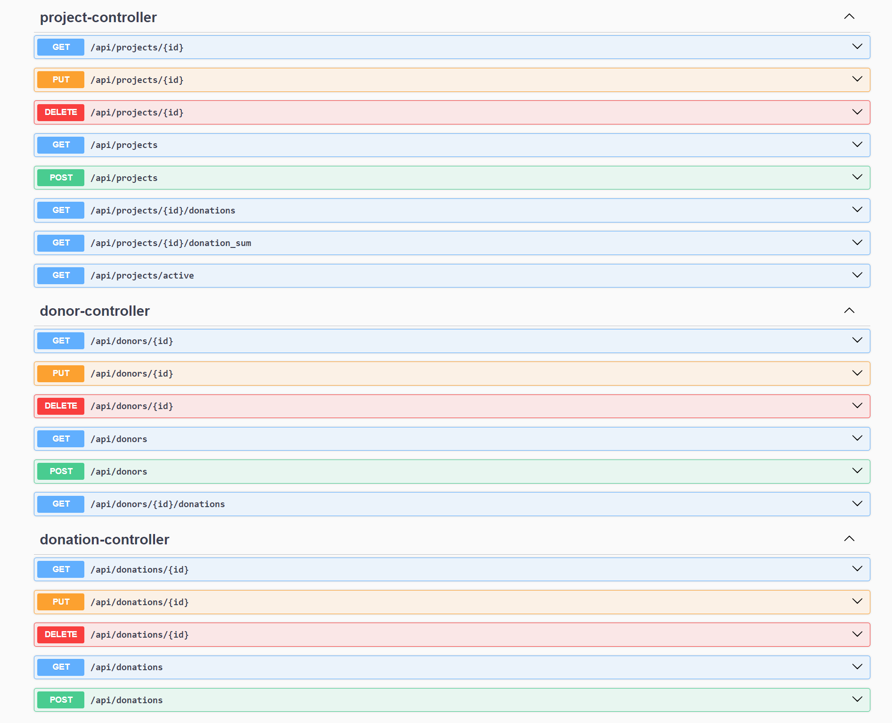
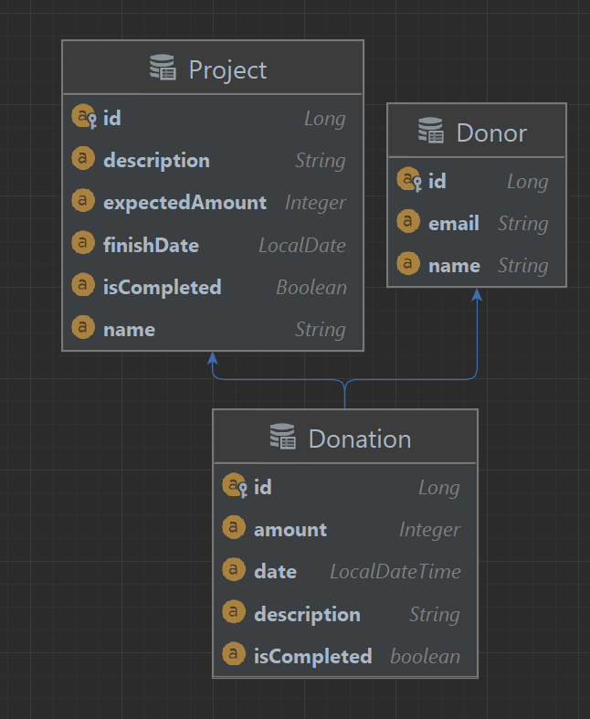

### REST API
[http://localhost:8080/swagger-ui/index.html](http://localhost:8080/swagger-ui/index.html)

### Functional Requirements

1. Manage Donations: Add, view, update, and delete donation details.
2. Manage Donors: Add, view, update, and delete donor details.
3. Manage Projects: Add, view, update, and delete project details.
4. View All Donations: Display a list of all donations in the system.
5. View All Donors: Display a list of all donors.
6. View All Projects: Display a list of all Projects.
7. Secure Login: Implement a secure login system to restrict access.
8. Daily Donation Update: Automatically update donation isCompleted status when expected amount of donation money is reached.
9. Modify Donation Information: Update any information about donation.
10. Modify Donor Information: Update any information about an donor.
11. Modify Project Information: Update any information about project.
12. Delete Donation: Remove donation from the system.
13. Delete Donor: Remove a donor from the system.
14. Delete Project: Remove project from the system.
15. View active Projects: Display a list of all active projects.
16. get Calculated Sum of Donations: Calculate the total amount of donations to some project.
17. view API Documentation: Use Swagger to document the API.
18. View every donation made by a donor.

### ERD

